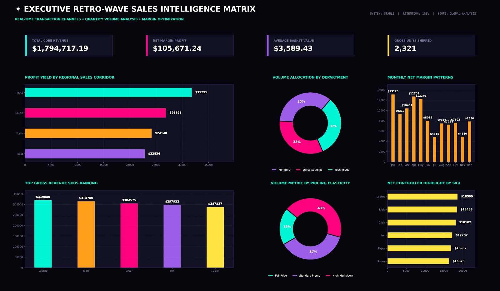

# ✦ Executive Sales Intelligence Matrix - Track: DS

## 📝 Project Overview
This repository contains a high-fidelity, corporate dark-mode analytics dashboard engineered using Python (`pandas`, `matplotlib`, and `gridspec`). The objective was to build a multi-tonal executive control center optimizing regional revenue channels, product performance metrics, and volume allocation with zero data-text collisions.

## 📊 Visual Presentation Matrix

## 📁 Final Repository Structure
* `FUTURE_DS_02/` (Repository root folder)
  * `executive_sales_dashboard.py` - Core Python generation script with layout safety pads.
  * `UltraClean_Executive_Dashboard.png` - Exported 300 DPI high-contrast presentation graphic.
  * `Sample_Business_Sales_Data.csv` - Raw transaction dataset used for matrix operations.
  * `README.md` - Verification report and implementation highlights.

## 🛠️ Defensive Layout & Collision-Protection Highlights
* **Donut Chart Segoupling:** Extracted outer string text blocks from `Volume Allocation` and `Volume Metric` pie wedges and relocated them into clean lower legends, securing 100% readability for nested segment percentages.
* **Bar Coordinate Air-Gapping:** Extended horizontal margins (`xlim`) on horizontal charts by 25% beyond maximum values to completely isolate numeric metrics from grid boundaries.
* **Ceiling Scaling Pass:** Padded vertical limits (`ylim`) on the `Monthly Net Margin` timeline chart by 15% to eliminate text compression under graph roofs.
* **Dynamic Temporal Conversion:** Converted multi-character monthly tags to ultra-sharp 3-letter enterprise tags (`Jan`, `Feb`, `Mar`) for seamless grid fit.
